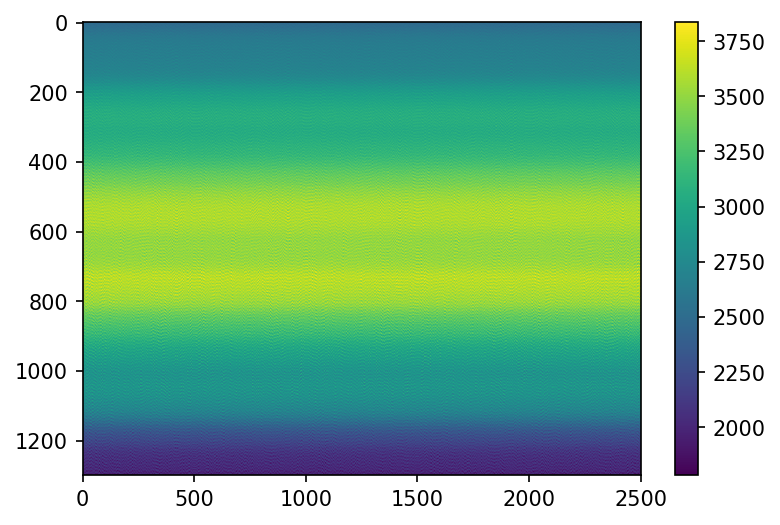
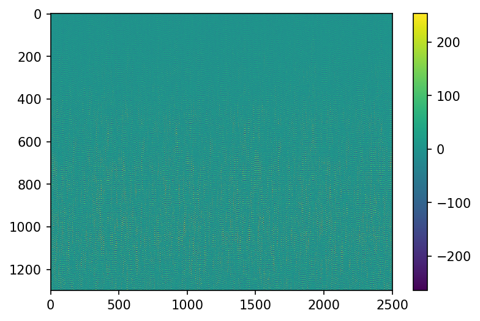
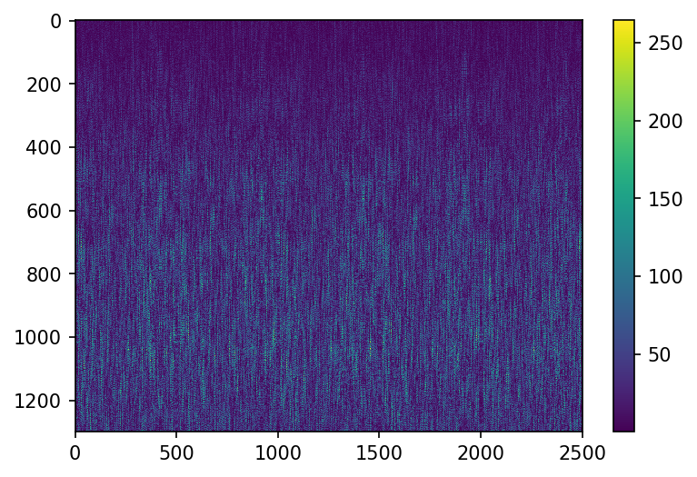
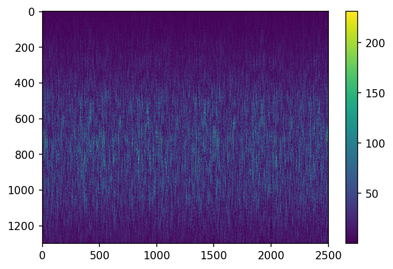
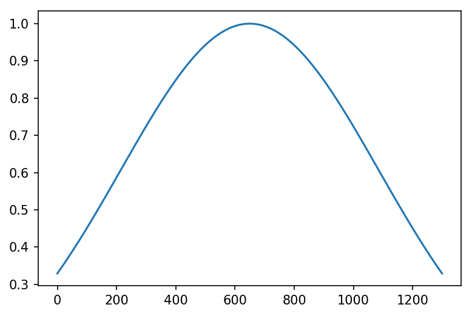
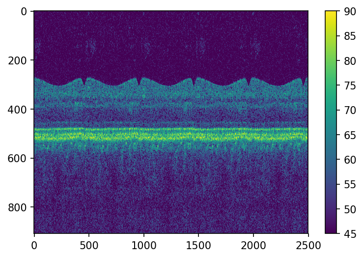
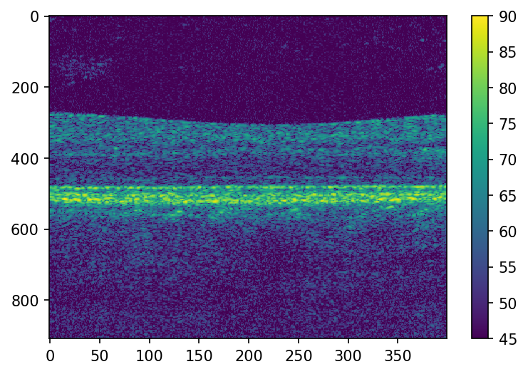
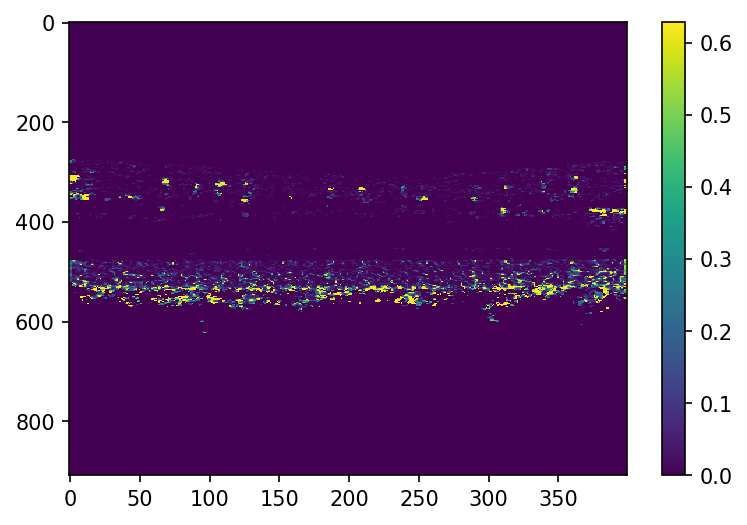

# Octoblob: some Python tools for doing OCT/OCTA processing

This document contains instructions for installing, interactively running OCTA processing, and creating batch scripts. It is meant to illustrate the architecture of the processing tool chain, the distinction between the OCT/OCTA libraries and processing scripts, and other important (and confusing) issues. In actuality, the OCTA data will be processed using Python scripts (i.e., batch processing), with no interaction with the user.

## Prerequisites

Unfortunately there are two versions of Python currently in widespread use--2.7 and 3.7+ (referred to as Python 2 and Python 3). Currently, Octoblob is written in such a way that it is compatible with Python 2 and 3, but this is unlikely to continue to be the case. Here are instructions for a few cases; all downloads are located [here](https://www.anaconda.com/products/individual).

1. You don't have Python installed at all, and know of no reason to have a Python 2 installation. In this case, just install the Python 3 Anaconda distribution.

2. You use Python 2 extensively and don't want to mess anything up. In this case, you'll need to verify that you have Numpy, Scipy, and Matplotlib installed. Basic octoblob functions will work in Python 2.

3. You use Python 2 but want to create a virtual Python 3 environment. You can do this by executing the following (assuming you want to call the virtual environment "python3"; you can call it whatever you want).

    ```conda create -n python3 python=3```
    
    ```source activate python3``` or ```conda activate python3```, depending on your OS.
    
    ```conda install numpy scipy matplotlib ipython jupyter```
    
    If you choose this option, you will have to remember to switch to your python3 environment using ```source activate python3``` before running any octoblob scripts.
  
4. You don't need Anaconda of course. If you know what you're doing you can just install Python, Numpy, Scipy, Matplotlib, Ipython, Jupyter, and a virtual environment manager if you wish.

## Environmental variables

Generally speaking, you should have one folder on your computer where you store Python modules--both those that you create and those that you download. As a convention, on the machines in our lab we always use ```C:\code```, but anywhere is fine. Look at the environmental variables on your machine, and see if ```PYTHONPATH``` is defined. If it is, and ```C:\code``` isn't part of it, add it to the path (using the correct delimiter, e.g. ';', for your system). If it's not defined, then create a new envornment variable ```PYTHONPATH``` and set it to ```C:\code```.

## Git and cloning

There are ways to proceed without installing Git, but Git is the best. Install Git, making sure to install the command line tools if you're using Windows. Then, using your terminal, change into ```C:\code``` and issue:

```git clone https://github.com/rjonnal/octoblob```

If your Python is installed and configured correctly, you can change directories into ```octoblob/tests```, type ```python test_create_angiograms.py```, and watch your computer make some angiograms. Try it, it's fun!

## Getting started

The first step in constructing a script is to import the tools you'll need. ```numpy``` and ```matplotlib``` are the standard numerical and plotting libraries in Python, and are always imported. The ```__future___``` and ```builtins``` imports implement some Python 3 functions, which will make porting this to Python 3 easier.

```octoblob``` is the unfortunate name I've chosen for the OCT/OCTA processing libraries. It is a descendent of the now obsolete ```octopod``` and ```cuttlefish``` libraries we've used in the past. We could have imported all the classes and functions from octoblob with ```from octoblob import *```, but it's better practice to keep the module name around, so that when module functions are called (e.g. ```bscan = blob.make_bscan(data)```), it's clear that the function is coming from the octoblob package, and clear where one needs to go to find the definition of the function. 


```python
from __future__ import (absolute_import, division,
                        print_function, unicode_literals)
from builtins import *
import numpy as np
from matplotlib import pyplot as plt
import octoblob as blob
```

## Some architectural principles

1. One reasonable way to think about scientific software is to split it into two categories: **libraries** and **scripts**. Libraries are collections of functions (and *classes*--more on that later) where each function and class has a well-defined goal, and the implementations have been extensively tested or otherwise verified to be correct. We *really* don't want any errors in a library. Scripts are the day-to-day programs we run. Some are batch scripts that process lots of data autonomously, and others are exploratory, where we run them to see what the data looks like, often in order to help us design the next step in the processing pipeline. Sometimes a portion of a script becomes used so frequently that it makes sense to turn it into a library functions and thus simplify the script.

2. Specifically with regard to the OCT/OCTA processing pipeline, I believe the libraries should be split into two parts: 1) a library for reading raw data and getting it organized, and 2) a library for turning raw data into OCT/OCTA images. The first of these is handled by a *class*, and the second is handled by a set of *functions*.

3. **Classes**. If you're not familiar with object-oriented programming, all you need to know about a class is that it is a specification for an *object*, i.e. a list of functions and variables that are stored together and somehow insulated from the rest of the code. The raw OCT data is handled by a class, because it needs to keep track of lots of information about the data. We create an ```OCTRawData``` class, and it keeps track of how many bytes there are per pixel, how many pixels per spectrum, how many spectra per B-scan, etc. By implementing this with a class, we don't have to specify how to get the raw data every time we need a new frame. We just instantiate the object and then ask it for frames, which will be illustrated below.

## Parameters for the ```OCTRawData``` class

The ```OCTRawData``` class needs to know how to get a frame out of the file, and to do that it needs a bunch of parameters. Let's specify these first. They should be self-explanatory, but trailing comments may clarify in some cases.


```python
# PARAMETERS FOR RAW DATA SOURCE
filename = '../octa_test_set.unp' # name of the raw data file
n_vol = 1 # number of volumes
n_slow = 4 # number of B-scans in each volume
n_repeats = 5 # number of repeats for OCTA data
n_fast = 2500 # number of A-scans per B-scan x number of repeats
n_skip = 500 # number of A-scans to skip at the start
n_depth = 1536 # number of pixels per spectrum
bit_shift_right = 4 # ignore for now
dtype=np.uint16 # the data type of the raw data

fbg_position = 148 # if there is an FBG, approximately where is it located
spectrum_start = 159 # where does the spectral data start (i.e. after FBG)
spectrum_end = 1459 # where does the spectral data end (i.e., before any dead/dark time at the end)
```

Now we can instantiate the ```OCTRawData``` object, which will later be used to get frames.


```python
src = blob.OCTRawData(filename,n_vol,n_slow,n_fast,n_depth,n_repeats,
                      fbg_position=fbg_position,
                      spectrum_start=spectrum_start,spectrum_end=spectrum_end,
                      bit_shift_right=bit_shift_right,
                      n_skip=n_skip,dtype=dtype)
```

    File size incorrect.
    30720000	expected
    32256000	actual
    n_vol		1
    n_slow		4
    n_repeats	5
    n_fast		2500
    n_depth		1536
    bytes_per_pixel	2
    total_expected_size	30720000


The "File size incorrect" warning is just telling us that there are more bytes in the file than we need. This is because using Yifan's software and the Axsun source, there's no synchronization between the slow scanner and the data acquisition, such that the first set of N repeats can begin on any of the first N frames.

## Parameters for OCT/OCTA processing

In addition to the raw data parameters, the code needs to know how to process the OCT data. These parameters are of greater interest to OCT scientists, and are subject to continual revision and refinement.


```python
# PROCESSING PARAMETERS
mapping_coefficients = [12.5e-10,-12.5e-7,0.0,0.0]
dispersion_coefficients = [0.0,1.5e-6,0.0,0.0]

fft_oversampling_size = 4096

# Cropping parameters:
bscan_z1 = 3147
bscan_z2 = -40 # negative indices are relative to the end of the array
bscan_x1 = 0
bscan_x2 = -100 # negative indices are relative to the end of the array
```

## Pulling and processing an OCTA frame

Let's say we want to process one OCTA frame, using the OCTRawData object ```src``` defined above.

First, we need to get the raw spectra. Let's adopt the convention of calling these **frames**. A frame has dimensions ```n_k * n_x```, where ```n_k``` is the number of points in the k-dimension (the vertical/first dimension, by convention) and ```n_x``` is the number of points in the fast scan dimension, including repeats. Our B-scans are 500 pixels wide, and we have 5 repeats, so a single frame will contain 2500 A-scans. Remember that Python, like every sane programming language, begins indices with 0, not 1. We'll get the first frame and see what it looks like.


```python
frame = src.get_frame(0)
plt.figure(dpi=150)
plt.imshow(frame,aspect='auto')
plt.colorbar()
plt.show()
```





## OCT processing pipeline

The next steps in the process are 1) DC-subtraction, 2) k-resampling, 3) dispersion compensation, 4) windowing, and 5) FFTing (and oversampling) the spectra into a B-scan. These are illustrated next.


```python
frame = blob.dc_subtract(frame)
plt.figure(dpi=150)
plt.imshow(frame,aspect='auto')
plt.colorbar()
plt.show()
```


```python
frame = blob.k_resample(frame,mapping_coefficients)
plt.figure(dpi=150)
plt.imshow(frame,aspect='auto')
plt.colorbar()
plt.show()
```





```python
frame = blob.dispersion_compensate(frame,dispersion_coefficients)
plt.figure(dpi=150)
plt.imshow(np.abs(frame),aspect='auto') # need 'abs' because dispersion compensation introduces imaginary component
plt.colorbar()
plt.show()
```





```python
frame = blob.gaussian_window(frame,0.9)
plt.figure(dpi=150)
plt.imshow(np.abs(frame),aspect='auto') # need 'abs' because dispersion compensation introduces imaginary component
plt.colorbar()
plt.show()
```





### Let's have a look at the Gaussian window, just for fun, by running it on a vector of ones


```python
window_shape = blob.gaussian_window(np.ones(frame.shape[0]),0.9)
plt.figure(dpi=150)
plt.plot(window_shape)
plt.show()
```





### Now we generate a B-scan from the spectra


```python
bscan = blob.spectra_to_bscan(frame,oversampled_size=fft_oversampling_size,z1=bscan_z1,z2=bscan_z2)
# need 'abs' because dispersion compensation introduces imaginary component
dB_bscan = 20*np.log10(np.abs(bscan)) 
# define rough contrast lims--if our sensitivity is 90 dB and our dynamic range is 45 dB, then (45,90) will work.
clim = (45,90)
plt.figure(dpi=150)
plt.imshow(dB_bscan,clim=(45,90),aspect='auto') 
plt.colorbar()
plt.show()
```





### Now we have to reshape the compound B-scan into a stack of 5 (n_repeats) individual B-scans

We'll check the shape of the stack (3D array), and then we'll visualize the first one in the stack, as sanity checks.


```python
stack_complex = blob.reshape_repeats(bscan,n_repeats,x1=bscan_x1,x2=bscan_x2)
print(stack_complex.shape)
# remember that the original array bscan was complex; we used abs and log10 to visualize it before
dB_first_bscan = 20*np.log10(np.abs(stack_complex[:,:,0]))
# define rough contrast lims--if our sensitivity is 90 dB and our dynamic range is 45 dB, then (45,90) will work.
plt.figure(dpi=150)
plt.imshow(dB_first_bscan,clim=(45,90),aspect='auto') # need 'abs' because dispersion compensation introduces imaginary component
plt.colorbar()
plt.show()
```

    (909, 400, 5)





### Lastly, we'll convert this stack of complex repeats into an angiogram


```python
phase_variance = blob.make_angiogram(stack_complex)
plt.figure(dpi=150)
plt.imshow(phase_variance,clim=(0,0.2*np.pi),aspect='auto') # need 'abs' because dispersion compensation introduces imaginary component
plt.colorbar()
plt.show()
```




### Processing parameters

No processing parameters are stored alongside processing functions. They are all stored in the file ```processing_parameters.py``` at the top level. This improves transparancy of the pipeline, and forces values to be codified in releases, which is good. That way, for a given release of the software, the user will automatically get the parameters that were used by developers to process the test data and produce example images.

Here's the full parameter file, with comments:

```python
# This file contains parameters for the processing
# pipeline. It is meant to be frozen in releases of
# octoblob, such that processing can be reproduced
# perfectly without having to fiddle with them.

# coefficients for resampling lambda into k
# these coefficients c specify a polynomial p:
# p(x) = c_0*x^3 + c_1*x^2 + c_2*x + c_3
# p(x) is a the sampling error in x,
# and the measured spectra are interpolated from
# x -> x+p(x)
k_resampling_coefficients = [12.5e-10,-12.5e-7,0,0]

# these are the coefficients for the unit-amplitude
# phasor used for removing dispersion chirp; if the
# coefficients are c, then
# p(x) = c_0*x^3 + c_1*x^2 + c_2*x + c_3
# the dechirping phasor D is given by:
# D = e^[-i*p(x)]
# the spectra are dechirped by:
# dechirped_spectrum = spectra*D
dispersion_coefficients = [0.0,1.5e-6,0.0,0.0]

# the width of the window for gaussian windowing:
gaussian_window_sigma = 0.9

# paramters for bulk motion estimation, including
# smoothing by shifting bin edges; see Makita, 2006
# for a detailed description of the approach;
# in short, we do a histogram of the B-scan to B-scan
# phase error, with a fixed number of bins (n_bins);
# then, we shift the bin edges by a fraction of a
# bin width and recompute the histogram; the fractional
# shift is equal to 1/resample_factor
bulk_motion_n_bins = 16
bulk_motion_resample_factor = 24
bulk_motion_n_smooth = 5

# critical parameters: thresholds for bulk motion correction
# and phase variance computation
bulk_correction_threshold = 0.3
phase_variance_threshold = 0.43
```

### The OCTA processing functions

Obviously a lot of the work is buried in the OCTA processing functions, and we'll eventually document all of those clearly as well. Here, for example, is the dispersion compensation function. ```pp.dispersion_coefficients``` refers to the value set in ```processing_parameters.py```.


```python
def dispersion_compensate(spectra,coefficients=pp.dispersion_coefficients):
    # x_in specified on 1..N+1 to accord w/ Justin's code
    # fix this later, ideally as part of a greater effort
    # to define our meshes for mapping and dispersion compensation
    # on k instead of integer index
    x = np.arange(1,spectra.shape[0]+1)
    dechirping_phasor = np.exp(-1j*np.polyval(coefficients,x))
    return (spectra.T*dechirping_phasor).T
```

