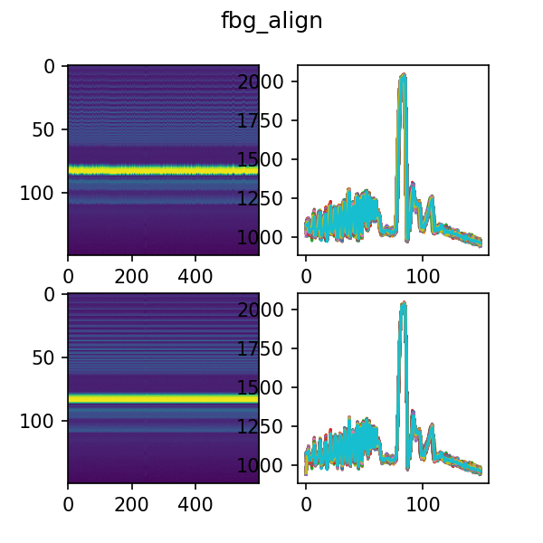

# Additional control of the FBG alignment algorithm

Spectra from the Axsun 100 kHz laser in the protoclinical ORG system are not well-aligned because of a k-clock problem. Therefore we have a fiber Bragg grating (FBG) at the laser output, which generates a notch at a specific value of k. In practice, due to polarization-sensitivity of the FBG and ambiguity introduced by balanced detection, the FBG notch manifests as a series of either notches or peaks--essentially a high-frequency fringe. When the Axsun was used for OCTA applications, a simple algorithm was used to align spectra--the most negative gradient (e.g., the falling edge of the trough) was identified and all spectra were aligned to it. Recently, this algorithm has not worked well, and additional control of FBG alignment is required in top-level scripts. Default behavior identifies the largest positive gradient, because this proved more generally effective than the most negative gradient. This example illustrates how to depart from default behavior.

The new FBG alignment function provided in the `process.py` uses cross-correlation instead of feature identification to align spectra. Broadly, this should be more resistant to variation in the FBG appearance among experiments, since it doesn't require the FBG features to be consistent.

Unlike most processing scripts, this `process.py` script does not call `octoblob.functions.spectra_to_bscan()` but instead defines its own `spectra_to_bscan` in order to utilize the custom FBG alignment function. Exposing the guts of the `spectra_to_bscan` function in the script offers some additional advantages: it permits users to observe the logic of the function and to specify parameters for other steps in processing such as cropping and windowing.




Please pay attention to the details of the `spectra_to_bscan` function. In particular, in this example, the cropping is hard coded in this section:

```python
    # artifact.png has a lens flare artifact after the 150th column, so we'll remove
    # it; we'll also remove 50 rows near the DC (bottom of the image):
    bscan = bscan[:-50,:150]
```

If you don't want to crop your B-scans, or if you want to crop them differently, you'll have to modify this section.

## Folder contents

* process.py: OCT/ORG processing script

* reset.sh: a bash script for deleting all of the downloaded and processed data, mainly for cleaning up this folder before pushing changes to github

## Download test data

To run this example you must download the test data from the links below:

* artifacts.unp: the spectral data stored in raw binary 16 bit unsigned integer format. 

  > Download [artifacts.unp](https://www.dropbox.com/s/5qk7gbfbx1gg62i/artifacts.unp?dl=0)
.

* artifacts.xml: acquisition parameters stored by the OCT instrumetation software during acquisition. 

  > Download [artifacts.xml](https://www.dropbox.com/s/6syd272xlebtubm/artifacts.xml?dl=0).

After downloading, put them into the `examples/handling_bscan_artifacts` folder.


## B-scan processing

1. (Optional) Edit the file `process.py`, and edit the value assigned to `data_filename`.

2. Using the Anaconda terminal (command prompt), change into the `octoblob/examples/handling_bscan_artifacts` folder and run the program by issuing `python process.py` at the command prompt. If you've skipped step 1, you'll need to specify the `.unp` filename at the command prompt, e.g., `python process.py artifacts.unp`.
