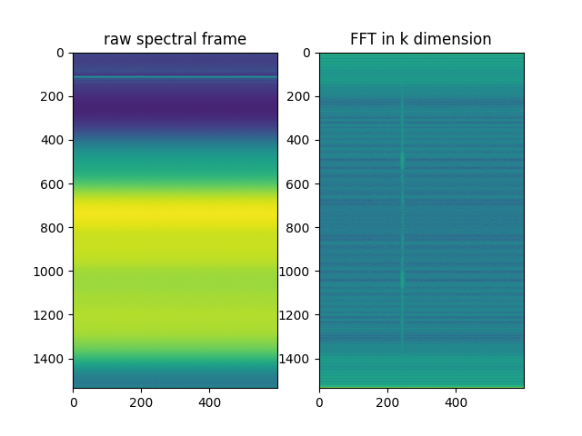

# B-scan processing for data with artifacts such as lens reflexes

Standard B-scan processing uses an automated algorithm for cropping the retina out of B-scans. This algorithm computes the axial centroid of the B-scan *intensity*, and selects 160 pixels on either side of that center of mass as the relevant portion of the B-scan. This works fine for retinal B-scans, but for other kinds of data, especially if they contain artifacts such as lens or mirror reflexes, automatic cropping will center the image about those artifacts instead of the features of interest. This script employs a B-scan generating function that does not automatically crop B-scans. The function is called `spectra_to_bscan_nocrop`. Instead of cropping around the center of mass of the image, it just crops out half of the B-scan--that is, one of the complex conjugate pairs.  

In addition, this example illustrates how to use the `x1` and `x2` parameters of the `DataSource` constructor and the `get_source` convenience function. When a dataset has significant artifacts not generated by the OCT sample (i.e. generated by lens reflections or stray light), and if these artifacts are similar in amplitude to the sample image, automated optimization of mapping and dispersion parameters will fail. They will result in parameters that maximize the brightness/sharpness of the artifact instead of the sample. Thus it is convenient to crop the B-scans laterally, and this can be done by passing parameters `x1` and `x2` to `get_source`, thus specifying the starting end ending columns of the B-scan to be used for optimization.

This version of `process.py` creates a single rough figure (seen below) in `figs/artifact_example.png` that allows the user to set values of `x1` and `x2` correctly. The user must know that the feature to be seen (in this case a mirror behind 40 dB of attenuation) is located toward the left side of the image, and observe that the artifact begins after the 200th column of the B-scan. This will allow the user to choose values of 0 and 200 for `x1` and `x2` respectively.

## Folder contents

* process.py: OCT/ORG processing script

* reset.sh: a bash script for deleting all of the downloaded and processed data, mainly for cleaning up this folder before pushing changes to github

## Download test data

To run this example you must download the test data from the links below:

* artifacts.unp: the spectral data stored in raw binary 16 bit unsigned integer format. 

  > Download [artifacts.unp](https://www.dropbox.com/s/5qk7gbfbx1gg62i/artifacts.unp?dl=0)
.

* artifacts.xml: acquisition parameters stored by the OCT instrumetation software during acquisition. 

  > Download [artifacts.xml](https://www.dropbox.com/s/6syd272xlebtubm/artifacts.xml?dl=0).

After downloading, put them into the `examples/handling_bscan_artifacts` folder.

## B-scan processing

1. (Optional) Edit the file `process.py`, and edit the value assigned to `data_filename`.

2. Using the Anaconda terminal (command prompt), change into the `octoblob/examples/handling_bscan_artifacts` folder and run the program by issuing `python process.py` at the command prompt. If you've skipped step 1, you'll need to specify the `.unp` filename at the command prompt, e.g., `python process.py artifacts.unp`.
