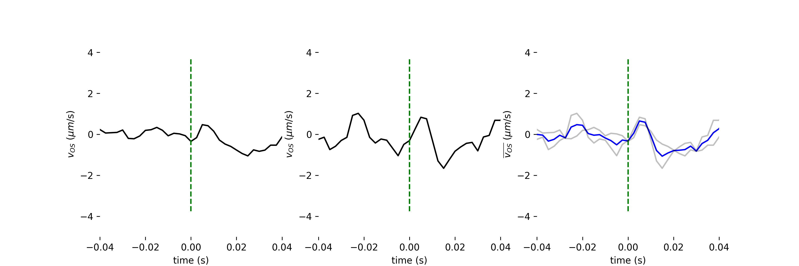

# Averaging ORG responses for arbitrarily chosen layers

## Folder contents

* plot_general_org.py: an interactive tool for visualizing phase changes between arbitrary, user-selected layers

* compute_average_responses.py: a script for averaging responses created using `plot_general_org.py`

* reset.sh: a bash script for deleting all of the downloaded and processed data, mainly for cleaning up this folder before pushing changes to github

## Download test data

To run this example you must download the test data from the links below:

* org_averaging_data.zip: the spectral data stored in raw binary 16 bit unsigned integer format. 

  > Download [org_averaging_data.zip](https://www.dropbox.com/s/z9q2tiw53dg5q24/org_averaging_data.zip). (Use the `Download` button instead of exploring the contents of the zip file.)
.

After downloading, put it into the `examples/org_averaging` folder and unzip.


## ORG visualization

1. Run the program `plot_general_org.py` by issuing `python plot_general_org.py` at the command prompt, in the same folder. If run this way, the program searches recursively for folders called `org` in the current directory and its subdirectories. Alternatively, you may issue `python plot_general_org.py ./test_bscans` to search only that subdirectory (recursively). In these cases, the program will run on each of the `org` folders it finds. Finally, you may specify a particular org folder with `python plot_general_org.py ./test_bscans/org`, in which case it will run only on that folder.

2. The input required by the user is clicking the end points of two line segments, one at a time. These line segments determine the layers between which phase velocities are computed. The user must click these line segments in a particular order--the left end of the top line segment, the right end of the top line segment, the left end of the bottom line segment, and the right end of the bottom line segment. The program will attempt to convert these line segments into arbitrary paths tracing the contour of the underlying layer by using the `refine_z` parameter:

```python
# refine_z specifies the number of pixels (+/-) over which the
# program may search to identify a local peak. The program begins by asking
# the user to trace line segments through two layers of interest. These layers
# may not be smooth. From one A-scan to the next, the brightest pixel or "peak"
# corresponding to the layer may be displaced axially from the intersection
# of the line segment with the A-scan. refine_z specifies the distance (in either
# direction, above or below that intersection) where the program may search for a
# brighter pixel with which to compute the phase. The optimal setting here will
# largely be determined by how isolated the layer of interest is. For a relatively
# isolated layer, such as IS/OS near the fovea, a large value may be best. For
# closely packed layers such as COST and RPE, smaller values may be useful. The
# user receives immediate feedback from the program's selection of bright pixels
# and can observe whether refine_z is too high (i.e., causing the wrong layer
# to be segmented) or too low (i.e., missing the brightest pixels.
```

Selection of these line segments causes the $v$ plot for that region to appear in the right panel. When multiple regions are created, multiple plots are generated on the right, with the rectangles and plot lines color-coordinated for comparison. The `backspace` key deletes the last region, and clicking outside of the B-scan on the left clears all of the regions. The `enter` key saves the figure and associated data in two places: the working directory, in a folder called `layer_velocities_results` and in the `org` folder containing the raw ORG data.

## ORG averaging

To produce averaged ORG plots, run the `compute_average_responses.py` script. Without modification, it will search for data saved in the previous *ORG visualization* step, and average all located data. It will produce a large figure with plots of the individual responses, as well as a plot of the average response. These will all be contained in the resulting `average.png` and `average.pdf` files, which will be overwritten by successive runs. The output files are meant to be manually cropped/cut for use.

**Important:** because the results of plotting above are stored in multiple locations, you have to guard against averaging together multiple copies of the same responses. This can be accomplished in two ways:

1. Pass a command line argument to `compute_average_responses.py`, as in `python compute_average_responses.py layer_velocity_results` or, if as described below, you have already renamed that folder to describe the ORG region of interest, something like `python compute_average_responses.py OS_results` or `python compute_average_responses.py layer_velocity_results_SRS`.

## Multiple ORG types

If you are working on multiple ORG measurements in the same folder, e.g. IS, OS, and SRS, please change the names of the `layer_velocities_results` folders accordingly, e.g., `IS_results`, `OS_results`, `layer_velocity_results_SRS`, etc., and then either 1) specify the folder as an argument, e.g. `python compute_average_responses.py IS_results`, or 2) copy `compute_average_responses.py` into the results folder of interest and run it there. Otherwise, results from different layers will be averaged together, which makes no sense.

## Example results

### Average cone inner segment ORG responses



