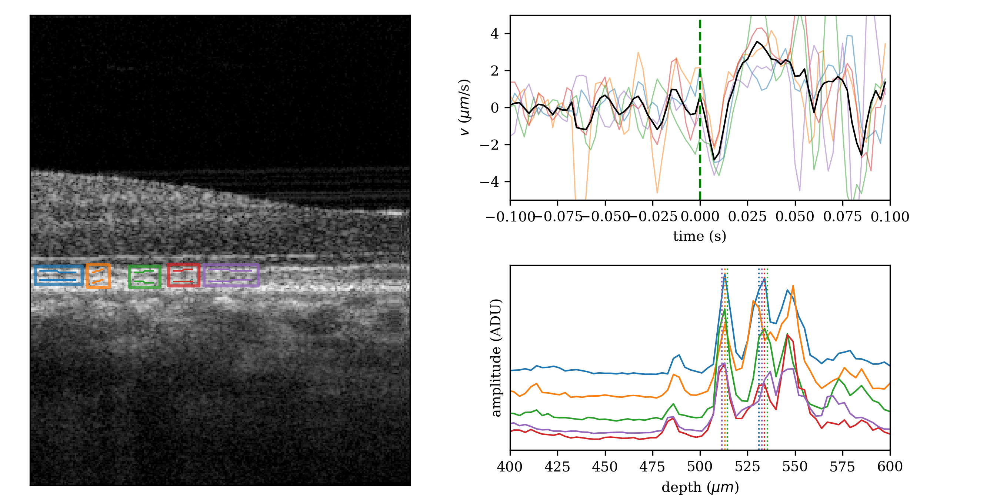
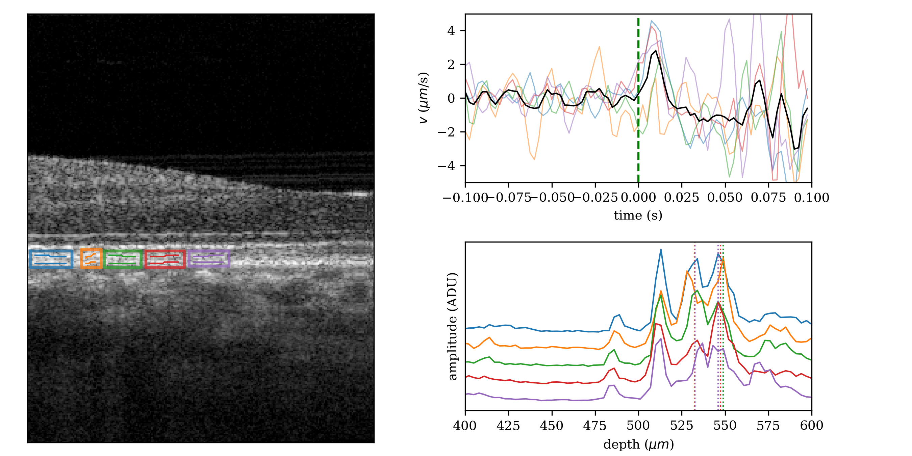

# Basic single flash ORG processing for arbitrarily chosen layers

## Folder contents

* process.py: OCT/ORG processing script

* plot_general_org.py: an interactive tool for visualizing phase changes between arbitrary, user-selected layers

* reset.sh: a bash script for deleting all of the downloaded and processed data, mainly for cleaning up this folder before pushing changes to github

## Download test data

To run this example you must download the test data from the links below:

* test.unp: the spectral data stored in raw binary 16 bit unsigned integer format. 

  > Download [test.unp](https://www.dropbox.com/s/pf6b951mlntqq9l/test.unp?dl=1)
.

* test.xml: acquisition parameters stored by the OCT instrumetation software during acquisition. 

  > Download [test.xml](https://www.dropbox.com/s/ux5qlinqq6y1zy4/test.xml?dl=1).

After downloading, put them into the `examples/single_flash_general_org` folder.


## OCT/ORG processing

1. Edit the file `process.py`, and edit the values assigned to `data_filename`, `org_start_frame`, and `org_end_frame` as needed. For single flash experiments, only a subset of B-scans must be processed; see the code comment for details. For flicker experiments, the entire set of B-scans must be processed.

2. Using the Anaconda terminal (command prompt), change into the `octoblob/examples/single_flash_org` folder and run the program by issuing `python process.py` at the command prompt. This will take a few minutes. The ORG processing in particular is somewhat slow.

## ORG visualization

1. Run the program `plot_general_org.py` by issuing `python plot_general_org.py` at the command prompt, in the same folder. If run this way, the program searches recursively for folders called `org` in the current directory and its subdirectories. Alternatively, you may issue `python plot_general_org.py ./test_bscans` to search only that subdirectory (recursively). In these cases, the program will run on each of the `org` folders it finds. Finally, you may specify a particular org folder with `python plot_general_org.py ./test_bscans/org`, in which case it will run only on that folder.

2. The input required by the user is clicking the end points of two line segments, one at a time. These line segments determine the layers between which phase velocities are computed. The user must click these line segments in a particular order--the left end of the top line segment, the right end of the top line segment, the left end of the bottom line segment, and the right end of the bottom line segment. The program will attempt to convert these line segments into arbitrary paths tracing the contour of the underlying layer by using the `refine_z` parameter:

```python
# refine_z specifies the number of pixels (+/-) over which the
# program may search to identify a local peak. The program begins by asking
# the user to trace line segments through two layers of interest. These layers
# may not be smooth. From one A-scan to the next, the brightest pixel or "peak"
# corresponding to the layer may be displaced axially from the intersection
# of the line segment with the A-scan. refine_z specifies the distance (in either
# direction, above or below that intersection) where the program may search for a
# brighter pixel with which to compute the phase. The optimal setting here will
# largely be determined by how isolated the layer of interest is. For a relatively
# isolated layer, such as IS/OS near the fovea, a large value may be best. For
# closely packed layers such as COST and RPE, smaller values may be useful. The
# user receives immediate feedback from the program's selection of bright pixels
# and can observe whether refine_z is too high (i.e., causing the wrong layer
# to be segmented) or too low (i.e., missing the brightest pixels.
```

Selection of these line segments causes the $v$ plot for that region to appear in the right panel. When multiple regions are created, multiple plots are generated on the right, with the rectangles and plot lines color-coordinated for comparison. The `backspace` key deletes the last region, and clicking outside of the B-scan on the left clears all of the regions. The `enter` key saves the figure and associated data in two places: the working directory, in a folder called `layer_velocities_results` and in the `org` folder containing the raw ORG data.

## Example results




