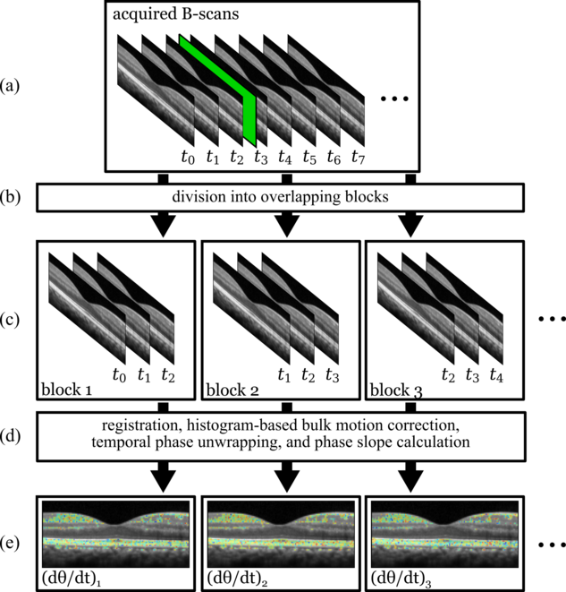

## Instructions for using the simplified octoblob scripts

### TL;DR

#### Human

```python
# copy parameters_template.py to parameters.py
cp parameters_template.py parameters.py

python parameters_helper.py data.unp
# edit spectrum and fbg parameters

python parameters_helper.py data.unp
# edit bscan cropping parameters

# try automatic mapping/dispersion optimizer:
python mapping_dispersion_optimizer.py data.unp

# if the resulting B-scan doesn't look good, do it manually:
python mapping_dispersion_manual.py data.unp

# edit mapping and dispersion coefficients

python process_bscans.py data.unp (show) (diagnostics)
python flatten_volume.py data_bscans/

python project_enface_dB.py data_bscans/flattened/ 0 3 45 75 1 1 100
# parameters in the previous command are:
# python project_enface_dB.py data_bscans/flattened/ (z1) (z2) (dB min) (dB max) (auto) (plot axial profile) (dpi)
# the way we ran it, it will automatically (auto) generate projections of thickness 3 (z1, z2), scaled between 45 and 75 dB (dB min, dB max), including axial profile plots (plot axial profile), with an output dpi of 100 (dpi)
```

#### Mouse or cell cultures

```python
# copy parameters_template.py to parameters.py
cp parameters_template.py parameters.py

python parameters_helper.py data.unp
# edit spectrum and fbg parameters

python parameters_helper.py data.unp
# edit bscan cropping parameters

# if multiple B-scans appear in preview, edit data.xml file,
# reducing the Number_BM_Scans value to 1

python mapping_dispersion_manual.py data.unp
# edit mapping and dispersion coefficients

python process_bscans.py data.unp (show) (diagnostics)
python flatten_planar_volume.py data_bscans/

python project_enface_dB.py data_bscans/flattened/ 0 3 45 75 1 1 100
# parameters in the previous command are:
# python project_enface_dB.py data_bscans/flattened/ (z1) (z2) (dB min) (dB max) (auto) (plot axial profile) (dpi)
# the way we ran it, it will automatically (auto) generate projections of thickness 3 (z1, z2), scaled between 45 and 75 dB (dB min, dB max), including axial profile plots (plot axial profile), with an output dpi of 100 (dpi)
```


### Part 1: generic OCT post-processing

In general, these scripts should be copied to the folder containing the data files (or the parent folder, if data with identical parameters are organized in subfolders. Scripts are invoked as follows:

```python script_name.py path/to/data/file.unp flag1 flag2```

The ```octoblob/scripts``` folder contains an example dataset in ```octoblob/scripts/data```, which will be used for the examples below.

#### Initial ```parameters.py``` file

You must start with a ```parameters.py``` file with at least the following parameters defined:

```python
###############################################
# Critical parameters; must be set in all cases:
bit_shift_right = 4
dtype=np.uint16
fft_oversampling_size = None

# Parameter estimation limits
# To use the parameter estimation UI for dispersion compensation and
# mapping parameters, you have to set the limits for the coefficients
# in the display. If you are using the UIs and find either that the
# optimal parameters are very close to the center or very close to the
# edge of the window, these can be adjusted to modify the search space.
# In both dispersion and mapping, the third order coefficients are in the
# y-dimension in the window and the second order coefficients in the x.

# dispersion compensation limits
c3max = 1e-8
c3min = -1e-8
c2max = 1e-4
c2min = -1e-4

# mapping limits
m3max = 1e-8
m3min = -2e-7
m2max = 1e-5
m2min = -1e-5

# Leave n_skip at 0 unless you have orphaned angiography
# BM scans at the start of the file (FDML issue only)
n_skip = 0

# Leave this False for now
use_multiprocessing = False
##############################################
```

#### Adjusting parameters in ```parameters.py```

Issue:

```python parameters_helper.py data/oct_test_set.unp```

The resulting plots will assist you to adjust the following parameters; your exact values may differ slightly. The plot assisting with B-scan cropping shows an average of every 10th B-scan in the series, which will assist with cropping in the presence of axial eye movements.

```python
##############################################
# Spectrum parameters:
# set fbg_position to None to skip fbg alignment

fbg_position = None
spectrum_start = 159
spectrum_end = 1459

##############################################


##############################################
# B-scan cropping parameters:
# cropping parameters: negative numbers mean counting from the end of the array:

bscan_z1 = 1000
bscan_z2 = 1200
bscan_x1 = 0
bscan_x2 = -20

##############################################
```

#### Starting with fresh settings in ```parameters.py```

To start from scratch, first delete ```parameters.py``` and copy ```parameters_template.py``` to ```parameters.py```:

```cp parameters_template.py parameters.py```

Next, you will run ```parameters_helper.py``` twice. The first time will help you to enter values for ```fbg_position```, ```spectrum_start``` and ```spectrum_end```, and the second time will use these values to give a B-scan which will help you to set the B-scan cropping parameters.

Note: The ```fbg_position``` is relative to the top of the **uncropped** spectra. In other words, use the absolute position of the FBG trough in the first figure to note the approximate FBG location.

#### Estimating mapping and dispersion coefficients

Issue:

```python estimate_mapping_and_dispersion.py data/oct_test_set.unp```

The resulting interactive plots will allow you to set first the mapping and then the dispersion coefficients. Your last click determines the values that are printed to the terminal, and these should be copied and pasted into ```parameters.py```, e.g.:

```python
mapping_coefficients = [0.0,0.0,0.0,0.0]
dispersion_coefficients = [7.2e-09, -7.2e-05, 0.0, 0.0]
```
We sometimes use zeros for mapping coefficients even if other values make the image look slightly better, for simplicity. Non-zero mapping coefficients can generate artifacts in some cases.

#### A note on mouse data from the eyepod

In some cases, mouse data from the eyepod will use different logic in the configuration file, and multiple B-scans will be visible in second stage of running ```parameters_helper.py```. If this happens, the configuration ```.xml``` file should be modified as follows: change ```Number_of_BM_scans="3"``` (or whatever number is there) to ```Number_of_BM_scans="1"```. This will increase the number of B-scans in the series or volume, and may require later downsampling in the slow dimension to harmonize with the fast dimension.

#### Generating B-scans

To silently generate complex-valued ```.npy``` B-scan files:

```python process_bscans.py data/oct_test_set.unp```

To generate complex-valued ```.npy``` B-scan files and PNG files:

```python process_bscans.py data/oct_test_set.unp show```

To generate complex-valued ```.npy``` B-scan files and diagnostics:

```python process_bscans.py data/oct_test_set.unp diagnostics```

To generate complex-valued ```.npy``` B-scan files, PNG files, and diagnostics:

```python process_bscans.py data/oct_test_set.unp diagnostics show```

### Part 2: analyzing phase changes

#### Phase analysis of B-scans

This script moves through the processed B-scans in overlapping blocks, e.g. frames 0-4, 1-5, 2-6, etc.. In each block, the frames are rigid-body registered, bulk-phase corrected to the first B-scan in the block, and then the phase change over the block is computed for each pixel. Two thresholds have to be set, for bulk-motion correction and computing the signal. Both are expressed as fractions of the B-scan's maximum amplitude. More pixels should be used for histogram-based bulk motion correction (i.e., higher threshold) than phase ramp computation.

Three parameters to adjust near the top of the script are:

```python
block_size = 5
histogram_threshold_fraction = 0.2
signal_threshold_fraction = 0.05
```
### Part 3: Volumetric registration and averaging

1. Run ```flatten_volume.py folder_name``` on all the volume folders to be registered. This will create subfolders called ```flattened``` within those folders.
2. Edit ```crop_volumes.py```, modifying ```folder_list``` to contain the ```flattened``` folders created in step 1, and then run ```python crop_volumes.py```. This will create subfolders called ```cropped``` within the ```flattened``` folders.

3. Edit ```average_volumes.py```, adjusting the following parameters:

a. ```folder_list``` should contain the ```cropped``` folders generated in step 2.

b. ```block_size_list```, ```block_downsample_list```, and ```block_filter_sigma_list``` are lists of parameters for the multiscale registration algorithm. Each list must have the same number of items, and the number of items determines the number of scales in the multiscale approach. Preliminary settings are shown below, but we'll modify these (including the number of scales) as we start doing volume averaging:

```python
##############################################################################
block_size_list = [n_bscans,10,2]
block_downsample_list = [5,2,1]
block_filter_sigma_list = [10.0,5.0,2.0]
##############################################################################
```

### Block-based ORG analysis (single flash)

The principle of the 



